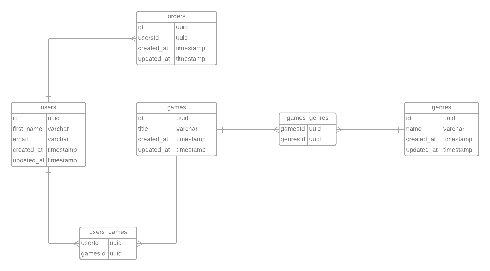

  <a href="#-complementary-challenge">Challenge</a>
  &nbsp;&nbsp;&nbsp;|&nbsp;&nbsp;&nbsp;
  <a href="#-diagram">Diagram</a>

# 🚀 Challenge 
The challenge is to do the data modeling of the [previous challenge](https://github.com/jvrapi/ignite-chapter-3-challenger)

# 🔥 Diagram

